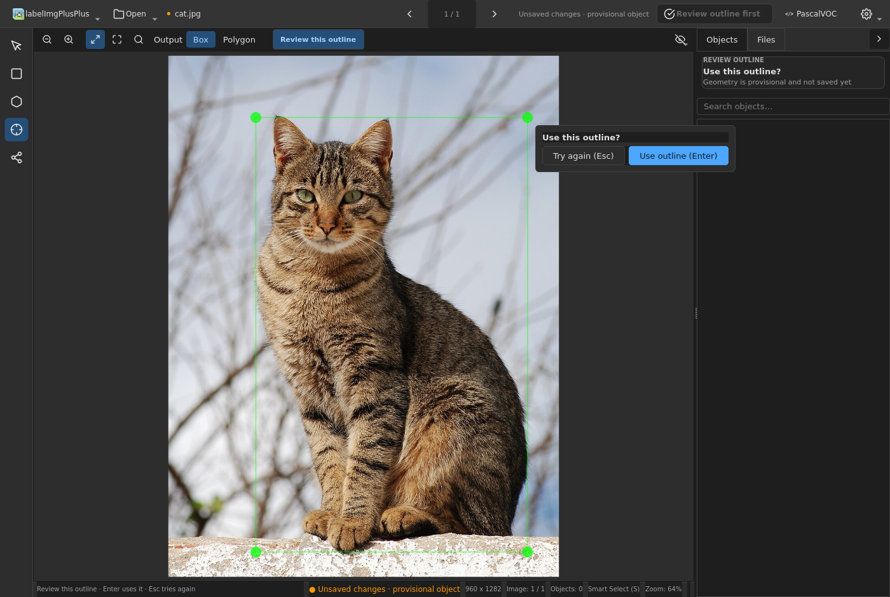

<!-- docs/features/sam-assisted-polygon.md -->
# Smart Select (SAM-assisted Box and Polygon)

Click an object to propose a box or polygon, review its outline, then assign
its class. Smart Select uses a MobileSAM ONNX encoder/decoder pair; it does not
require PyTorch.

## Install

Use Python 3.10 or newer (tested through 3.13). Once the **4.0.0rc1**
candidate is published on PyPI, install its pinned extra:

```bash
python -m pip install "labelimgplusplus[sam]==4.0.0rc1"
```

Before publication, or when working from the candidate source, run from its
repository root in the same virtual environment:

```bash
python -m pip install -e ".[sam]"
```

An unpinned stable-package install does not select this prerelease.
The extra supplies ONNX Runtime, NumPy, and headless OpenCV. Without it,
Smart Select is unavailable with an install hint; manual annotation still
works. See [Optional dependencies](../guides/optional-dependencies.md) for
combined image/video installs.

## First use and outline review

1. Open an image and activate **Smart Select** in the workspace tool rail
   (the corresponding menu action is **SAM Segment**).
2. Choose **Box** or **Polygon** in the contextual output toggle. Enabling the
   tool starts background image preparation, including the default model
   download if needed; it does not wait for the first object click. Changing
   images while the tool stays enabled prepares the next image. Subsequent
   clicks on the same image reuse its embedding.
3. Click inside an object. Review the provisional geometry beside the
   **Use outline (Enter)** and **Try again (Esc)** controls. Press `Enter` to
   use it, or `Escape` to discard it and try another point.
4. After outline approval, choose or type a class in the inline picker and
   confirm it. **Fixed class** or **Repeat last**, when a class is
   available, skips only this class-entry stage—not outline review.
5. Continue clicking objects; Smart Select stays active. Committed annotations
   can be edited and undone with `Ctrl+Z` like manually drawn shapes.




Screenshot photograph: Alvesgaspar, **Cat November 2010-1a**, CC BY-SA 3.0.
These annotated screenshot adaptations use the same license; see
[media sources and licenses](../screenshots/readme/LICENSE.txt).

## What Box and Polygon produce

Both outputs use the largest connected component of the predicted mask.
**Polygon** traces and simplifies its external contour, filling holes and
discarding other components. **Box** uses the tight axis-aligned bounds of
that same component.

Box currently shares the polygon-generation pipeline: a usable polygon must
be produced before either output is offered. It is not a separate Box-only
inference path. Empty, tiny, or degenerate results may produce **No object
found, try another point** rather than an annotation.

## Settings (Tools → SAM Settings…)

Leave both **Encoder model (.onnx)** and **Decoder model (.onnx)** empty to
download and cache the default MobileSAM pair. Alternatively, select two
trusted local model files; setting only one is rejected.

A custom pair must match the application's ONNX interface, not merely share
a SAM model name:

- The encoder receives float32 RGB `input_image` in H×W×3 layout after the
  longest side is resized to 1024. Normalization and padding must be in the
  encoder graph, whose first output supplies the image embedding.
- The decoder accepts `image_embeddings`, `point_coords`, `point_labels`,
  `mask_input`, `has_mask_input`, and `orig_im_size` with the shapes used by
  [the ONNX backend](../../libs/integrations/segmentation.py). It must return
  the expected three outputs, with a single mask in the first output at
  `[0, 0]`, restored to the original image size and thresholded at zero.
- Encoder and decoder embeddings, preprocessing, and output conventions must
  agree. Arbitrary SAM variants or exports are not automatically compatible.

The maintainer [MobileSAM export script](../../scripts/export_sam_onnx.py)
documents the export used for the default pair; it is not a general exporter
for arbitrary checkpoints.

## Video use

With both `sam` and `video` extras installed, Smart Select can create a manual
box or polygon observation on a paused video frame using the same outline and
class review. This MobileSAM helper does not propagate masks through time.
The separately configured **SAM 2** backend handles temporal propagation; see
[Smart video annotation](smart-video-annotation.md#optional-sam-2-backend).

## Model downloads and trust

The default pair is downloaded from the project's `sam-onnx-v1` GitHub release
and cached under `$XDG_CACHE_HOME/labelimgpp` (or `~/.cache/labelimgpp`).
Downloads and cached files are checked against SHA256 values pinned in
[the model cache](../../libs/integrations/model_cache.py) when resolving the
pair. A failed download or checksum mismatch is reported rather than loaded.

ONNX is a model format, not a guarantee that every model or runtime is safe.
Use trusted model sources and keep the runtime updated. Custom local paths
are accepted as trusted input and are not verified against the default pins.
The pins identify the expected default files; they are not a general security
audit of those files or the inference runtime.
