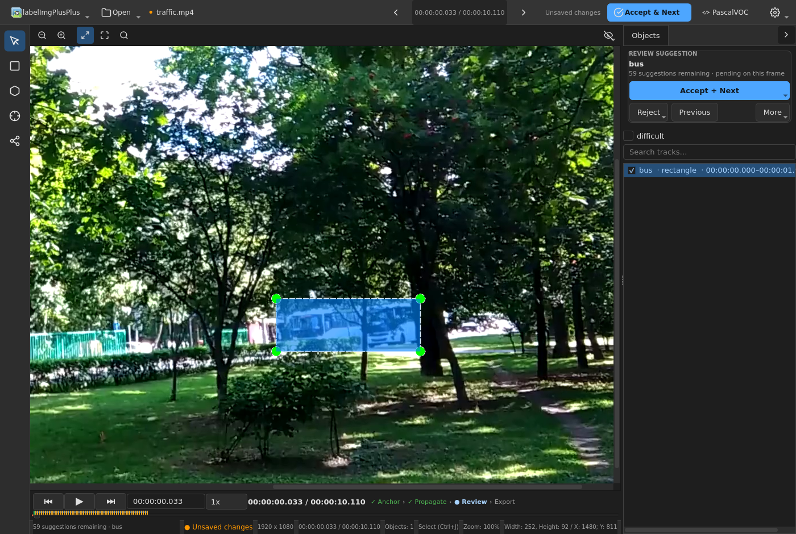

# Smart video annotation

Smart video mode adds timestamp-accurate annotation without changing the image
workflow or its file formats. It supports local MP4, MOV, MKV, and AVI sources,
uses the first playable video stream, applies display rotation, and ignores
audio.

## Install and open

Use Python 3.10 or newer (tested through 3.13). Once the **4.0.0rc1**
candidate is published on PyPI, install its pinned extra:

```bash
python -m pip install "labelimgplusplus[video]==4.0.0rc1"
labelimgpp /path/to/clip.mp4
```

Before publication, or when using candidate source, install from its repository
root in the same virtual environment with
`python -m pip install -e ".[video]"`. An unpinned stable-package install does
not select this prerelease. See
[Optional dependencies](../guides/optional-dependencies.md) for version markers
and combined SAM/video installation.

You can also use **File → Open Video…**, `Ctrl+Alt+V`, or pass an existing
`.labelimgpp.sqlite` project as the normal first positional argument.

Opening is transactional: the source, first frame, and project are validated
before the current document is replaced. A new project is created only after
the first frame decodes successfully. Its default path is the sibling
`<video-filename>.labelimgpp.sqlite`. If that directory is not writable, choose
another project path or cancel the picker to inspect the video read-only.

The project stores a sampled content fingerprint. Moving a video is safe when
the fingerprint still matches. Changed content is never combined with the old
annotations; locate the original source, create a new project, or cancel.

## Navigate the timeline

The bottom timeline contains play/pause, previous/next frame, an exact
`HH:MM:SS.mmm` entry, a normalized long-duration slider, and 0.25x, 0.5x, 1x,
and 2x playback. Elapsed time is the primary position language. Exact PTS and
the approximate frame number remain in the position tooltip because
variable-frame-rate media has no reliable integer frame index.

- `A` and `D` step backward and forward in video mode.
- `Ctrl+Space` toggles silent playback. `Space` verifies the current frame.
- Dragging the timeline is debounced; releasing it performs an exact
  latest-request-wins seek.
- Drawing or editing pauses playback automatically.

Blue spans show track coverage, green markers show accepted manual anchors,
amber markers show pending tracker suggestions, red spans show propagation
gaps, and purple markers show verified frames.



Demo footage: Samplelib's 10-second MP4 sample, offered without license
restrictions. See [media sources and licenses](../screenshots/readme/LICENSE.txt).

## Browse the video overview

Press `Ctrl+G` while a video is open to switch the browse slot between track
lanes and annotated frames. **Distinct** is an adaptive global summary: it
always retains first/last usable track observations, accepted manual anchors,
verified annotated frames, and the frames around coverage, provenance, review,
presence, and gap transitions. Between those events it keeps at most one
ordinary frame per 0.5-second presentation-time window, so the normal density
is no more than two ordinary frames per second. Explicit events can be denser.

Geometry appears immediately. A quiet **Refining…** hint means an independent
decoder is checking only the bounded sample plan for material pixel changes;
the result may add a frame but never removes the geometry answer or adds a
second ordinary frame in a window. Decode failure or cancellation leaves the
immediate result unchanged.

**Annotated** still shows every frame carrying a stored observation, including
rejected or absent records. **Pending** shows every suggestion awaiting review;
pending frames are not hidden merely because the Distinct summary collapses a
dense run to its boundaries. Selecting a lane only narrows the global frame
answer to that track and never recomputes a wider per-track selection.

The readiness row makes the export boundary explicit before a dialog opens.
It reports the live pending-suggestion count and the number of PTS values
carrying accepted, present observations, the exact count used by the default
**Annotated frames** export selection. With no pending work it exposes the
authoritative export action directly.

## Tracks, anchors, and interpolation

Drawing a rectangle or polygon on a video frame creates a UUID-backed track and
an accepted manual observation at the current PTS. The unified **Objects**
inspector shows the track label, span, color, visibility, provenance, render
state, and pending-review count, including tracks absent from the current
frame. Renaming a
tracked shape renames the track across the video.

Select a track and press `Shift+K` to make the current materialized occurrence
an editable manual keyframe. Rectangle geometry is interpolated by
presentation time between accepted manual anchors. Associated keypoints can
interpolate only when both anchors have equal-length, compatible layouts:
use the same landmark ordering at each anchor. Missing points and visibility
use the nearer anchor's values. Polygon vertices are never interpolated.
Blue dashed shapes are computed interpolation; amber dashed shapes are pending
tracker suggestions.

Deleting an exact occurrence removes that observation. Deleting an interpolated
occurrence writes an explicit absence anchor, which ends interpolation until a
later present anchor. **Tools → Delete Track…** removes all observations after
confirmation. Video mutations use the same undo stack as image annotations.

[MobileSAM Smart Select](sam-assisted-polygon.md) can create a manual box or
polygon observation on a paused video frame when both the `sam` and `video`
extras are installed. Outline approval still comes before class confirmation;
fixed/repeat class strategies skip only class entry. This single-frame helper
is separate from SAM 2 temporal propagation.

## Whole-video propagation

Select an exact accepted manual anchor and use **Propagate…** in its contextual
Objects card. **More → Propagate across video** includes every qualifying
anchor on the current frame. Both actions propagate backward and forward,
subject to the confirmed run scope. The timeline keeps the
Anchor → Propagate → Review → Export stage and active progress visible without
duplicating the selected-track commands.

The directional **Track Forward…** (`T`) and **Track Backward…** (`Shift+T`)
actions use this same propagation pipeline and configured backend, not a
separate legacy optical-flow UI. Their endpoint dialog defaults to the next
manual anchor in that direction, or five seconds when none exists.

The portable OpenCV backend decodes each direction once, updates active
rectangles, polygons, and associated keypoints together, and uses bounded
Lucas–Kanade flow with affine estimation. Results stream to a preview overlay;
the canonical project, save state, export data, and undo history remain
unchanged until the complete result passes document, media, generation, and
per-track revision checks. The tracker observations then commit as pending
suggestions, together with inclusive gap records, atomically as one undo step.
Use the current, visible-range, or full-run review actions to accept or reject
them; pending suggestions are not exported until accepted.

Manual anchors are never overwritten. Reaching another present anchor reseeds
that track; an absence anchor or failed track produces a stable ``occluded``,
``low_confidence``, ``out_of_frame``, or ``scene_cut`` gap while other tracks
continue. Cancel, document replacement, shutdown, stale state, or a backend or
decoder failure clears the preview without changing the durable project.

Editing tracker or interpolated geometry creates an accepted manual correction
immediately. A separate background job regenerates only the open segments up
to the nearest manual anchor on either side. Successful regeneration is a
second undo entry; failure or stale state preserves the correction and all
previous generated data.

## Optional SAM 2 backend

Open **Tools → SAM Settings…** and choose **Auto**, **OpenCV**, or **SAM 2**.
SAM 2 requires Linux, Python 3.10 or newer, compatible CUDA-enabled PyTorch
2.5.1 or newer and torchvision 0.20.1 or newer, an official SAM 2 source
installation, and a local checkpoint paired with its matching config. Select
the config from the installed `sam2` package (normally its `configs`
directory). Copying a YAML file elsewhere is not supported: the application
requires it to reside under that package so it can resolve the package-relative
config name. Matching the checkpoint architecture/version remains necessary.

Follow [Meta's official source-install and checkpoint instructions](https://github.com/facebookresearch/sam2#installation),
then select the two files in labelImg++. The application never downloads or
bundles Torch, SAM 2, their model checkpoints, or their configs, and these
packages are intentionally not part of the base, `sam`, `video`, or combined
extras. This is separate from Smart Select's default MobileSAM ONNX download.

**Auto** evaluates those requirements only when propagation starts and uses
SAM 2 when all are satisfied; otherwise it uses portable OpenCV. Explicit
**SAM 2** selection reports an actionable error without falling back. SAM 2
turns video masks into simplified polygons or tight rectangles matching the
track type and records no-object results as normal propagation gaps. The same
preview, atomic commit, manual-anchor, cancellation, revision, and undo rules
apply to both backends.

## Review suggestions

Suggestions remain pending until reviewed. **Review queue** starts or resumes
the ordered live queue on the canvas, holding the affected track selected:

- `Shift+Enter` accepts the current suggestion and advances.
- `Backspace` rejects the current suggestion and advances.
- **Previous** moves backward and wraps at the queue boundary.
- The **Tools** menu can accept or reject the visible range or the full latest
  propagation run.

Accepted tracker observations become exact states but remain tracker-generated,
non-anchor observations: acceptance alone does not create manual anchors for
interpolation or seeding another propagation run. Use `Shift+K` to promote an
occurrence, or edit its geometry to make a manual correction. Rejected
suggestions stay recorded so they do not immediately reappear. Rerunning a
range may replace pending or rejected suggestions, but never accepted or
manual observations.

## Save and recover

`Ctrl+S` flushes the video project; timer autosave uses the same revisioned
delta. Saves are serialized in SQLite transactions and retain dirty state on
failure or external revision conflict. Save As uses SQLite backup rather than a
file copy. Clean close checkpoints the WAL. Discard reloads the last durable
project state.

## Export frames with accepted annotations

Choose **Tools → Export Video Frames…**. The destination must be new or empty.
Frame selection and annotation eligibility are separate:

- **Current frame** selects the displayed frame.
- **Annotated frames** (the default) selects PTS values with stored accepted,
  present observations. Unlike the overview's Annotated browse mode, it does
  not select pending-only, rejected-only, or absent-only records, and it does
  not automatically include every interpolated frame.
- **Verified frames** selects frames marked verified.
- **Time range** samples a range by frames or seconds.

Current, verified, and range selections can include frames without accepted
objects; those images are still exported with no annotations. JPEG quality 95
is the default; PNG is lossless. Annotation output can be Pascal VOC, YOLO,
YOLO-seg, COCO, or CreateML. Annotated and verified selection labels show
their exact frame counts before confirmation.

On every selected frame, only accepted, present manual/tracker states and
accepted rectangle interpolation are exported. Pending and rejected
suggestions are excluded, regardless of frame selection. Names are stable:

```text
<video-stem>__s<stream-index>__p<pts>.<extension>
```

The exporter stages the whole result before publishing it and writes
`video_export_manifest.json` with the source fingerprint, PTS/time base,
verification state, and track IDs for every image.

## Scope

Live/network streams, audio playback or editing, multi-stream selection,
automatic propagation after drawing, bundled model runtimes/checkpoints, and
native MOT/CVAT-video project formats are not included.
